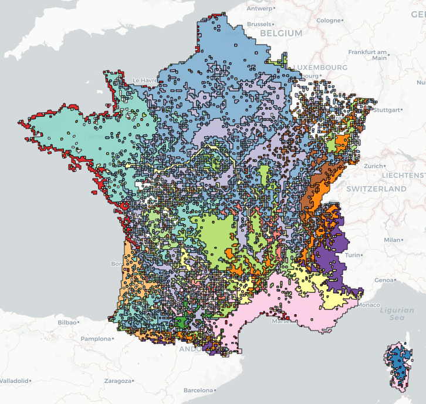

README
================

# bioRgeo 

# An R package to compare several methods of bioregionalization and estimate the contributions of species

`bioRgeo` is a package designed to compare several methods of
clustering based on multivariate or network
approaches.

## 1 Installation

``` r
devtools::install_github("bioRgeo", build_vignettes = TRUE)
```

## 2 Tutorial

A tutorial vignette showing the main steps of the processing can be
visualised with the following command line:

``` r
vignette("tutorial", package = "bioRgeo")
```

    ## Warning: vignette 'tutorial' not found

## 3 Dependencies

`bioRgeo` depends on `dplyr`, `ecodist`, `reshape2`, `fastcluster`,
`DescTools`, `ade4`, `cluster`, `sf`, `ggplot2`, `Rcpp`, `SMUT` and
`igraph`.
