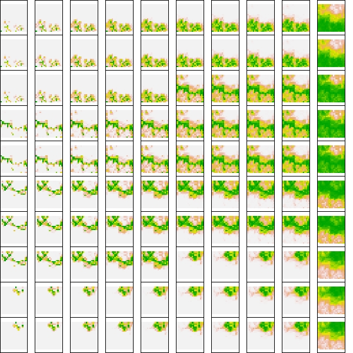

<style>
body {
text-align: justify}
</style>

# 1. Overview

In the following vignette, we show how `bioRgeo` package works. We use a simulated dataset of virtual species distributed across sites to illustrate how we can detect communities, i.e. groups of sites that are closely related regarding their species composition.

To detect these large-scale communities, `bioRgeo` uses a variety of methods, ranging from bipartite network modularity to classical clustering. Each method enables identifying groups of sites that are more similar between each other than compared with the rest of the sites available.

Our example and package is mostly designed for ecologists interested in detecting large-scale patterns in the distribution of species across environments but it can also be used in other fields interested in the detection of large-scale patterns.

The principle of the package is illustrated by the following figure.

```{r package_scheme, fig.label = "Workflow of the package."}
knitr::include_graphics("../figures/Bioregionalization_scheme3.png")
```

## 1.1. Glossary
Four types of formats are used in the package.

*contingency matrix*  
a matrix containing the distribution of species across sites. The species are in columns and the sites in rows. The matrix can either contain presences/absences or abundances of species within sites.  
This object is the first possible input of the `bioRgeo` functions.

*long format table*  
a data.frame in which each row indicates the occurrence of a species in a given site. The sites are therefore replicated as many times as the number of species they contain. A third column containing the abundances of species can be added. Without this column, every species present in this table is supposed to be present in the associated site.  
This format is the second possible input of the `bioRgeo` functions.

*adjacency matrix*  
a square matrix that contains *nm* rowns and columns, with *n* the number of sites and *m* the number of species. Both sites and species are in rows and columns. The matrix can be divided into four parts, the top-left corner being the contingency matrix. The bottom-right corner is the transposed contingency matrix. Since site-species matrix correspond to a bipartite network, there are no links between the same type of nodes. This means that there are no links between pairs of sites or between pairs of species. Top-right and bottom-left parts of this matrix are thus filled with 0.  
For more details, see [here](https://en.wikipedia.org/wiki/Adjacency_matrix).

*distance matrix* 
a square matrix containing the distances between each pairs of a set. In `bioRgeo`, we evaluate how pairs of sites are distant to each other regarding their species composition. Different distances can be computed.  
This type of matrix is usually stored as a `dist` object in R.

Since `bioRgeo` relies on two possible inputs, we let the option to users to switch from one format to the other using either `contingency()` or `contingency_to_dataframe()` functions as illustrated in the following figure: 

```{r input_figure, fig.label = "Two possible inputs.", fig.width = 4, fig.height = 4}
knitr::include_graphics("../figures/20200225_bioRgeo_inputs.png")
```

Several functions of the package necessitate to define the structure of the input.

```{r setup, include=FALSE}

knitr::opts_chunk$set(echo = TRUE, message = FALSE, warning = FALSE,
                      fig.width = 8, fig.height = 8)
# Packages --------------------------------------------------------------------
suppressPackageStartupMessages({
  suppressWarnings({
    library(bioRgeo)
    library(dplyr)
    library(sf)
    library(ggplot2)
    library(cowplot)
    library(igraph)
    library(RColorBrewer)
  })
})

options(tinytex.verbose = TRUE)

```

## 1.2 Virtual dataset
To illustrate how `bioRgeo` works, we use a virtual dataset. This dataset comes with the installation of the package and can be loaded using the following command:

```{r loading_virtual_data}
data("virtual_sp")
```

This command loads an object called `virtual` containing a list of three elements. 

The first element corresponds to the virtual dataset and comes as a `data.frame` with 40000 rows and 9 columns. The second and third element correspond to the partition found by the OSLOM algorithm (see below).  

The virtual dataset has been constructed by simulating the response curves of 100 species to a virtual raster.  
The virtual raster contains 10000 cells and was simulated using `gstat` R package. See [here](http://santiago.begueria.es/2010/10/generating-spatially-correlated-random-fields-with-r/) for details.  

After loading the virtual data, and since each site has XY coordinates, we can plot the raster of the virtual environment layer.

```{r plot_virtual_raster, fig.width = 4, fig.height = 4}
# Only species data.frame
sp_df <- virtual[[1]]

# Plot of environmental values
sp_df %>%
  distinct(site, .keep_all = TRUE) %>%
  ggplot(aes(x, y)) +
  geom_tile(aes(fill = env, color = env),
            alpha = 0.8, width = 1, height = 1) +
  scale_color_distiller("Value", palette = "RdYlBu") +
  scale_fill_distiller("Value", palette = "RdYlBu") + #OrRd
  coord_equal() +
  labs(title = "Environmental raster") +
  theme(panel.background = element_rect(fill = "transparent", colour = NA))

```

Based on this raster, we used the `virtualspecies` R package [(Leroy et al. 2015)](https://doi.org/10.1111/ecog.01388) to simulate a Gaussian response curve of 100 virtual species. The mean and standard deviation of the response function varied among species, drawing a continuum of generalist and specialist species.  

The following figure illustrates a response curve for one virtual species:

```{r virtual_sp_response_curve, fig.label = "Example of response curve for one virtual species."}

```

For every species in every cell, we could derive a suitability index and produce suitability maps as shown below.  
Species with suitability index inferior to 0.15 were arbitrarily set absent.

```{r virtual_sp_map, fig.label = "Example of suitability map for one virtual species."}

```

In total, the 100 suitability maps of our virtual species are distributed like this:
```{r 100_suitabilities, fig.label = "100 suitability maps for the virtual species."}

```

See [here](http://borisleroy.com/virtualspecies/) for further information on the `virtualspecies` R package.

### 1.2.1. Code to generate the virtual data
The code to generate the virtual dataset is provided in the chunk below. This chunk is not run when loading the vignette, since the outputs are directly stored with the package.

```{r virtual_dataset, eval = FALSE}
library(gstat) # virtual rasters with autocorrelation
library(sp) # spatial plots
library(cowplot) # combining plots
library(ggplot2) # plot
library(raster)
library(virtualspecies) # simulate virtual species
library(dplyr)
library(bioRgeo)

## Virtual raster layer -------------------------------------------------------
# http://santiago.begueria.es/2010/10/generating-spatially-correlated-random-fields-with-r/

# XY coordinates
xy <- expand.grid(1:20, 1:20)
names(xy) <- c("x","y")
# Spatial model
g_ex <- gstat(formula = z ~ 1 + x + y, locations = ~ x + y, dummy = TRUE,
              beta = c(1, 0.01, 0.005), nmax = 20,
              model = vgm(psill = 0.025, range = 50, model = "Exp"))

# Four layers created
set.seed(1)
yy <- predict(g_ex, newdata = xy, nsim = 4)

# Plottind rasters
gridded(yy) = ~x+y

plot_grid(spplot(obj = yy[1]), spplot(obj = yy[2]),
          spplot(obj = yy[3]), spplot(obj = yy[4]),
          nrow = 2)

# Data.frame with pixel and environmental value
env_dat <- cbind(yy[2]@coords, yy[2]@data)
env_dat$site <- paste0("site", 1:nrow(env_dat))

colnames(env_dat) <- c("x", "y", "env", "site")

# Environmental raster
env_raster <- env_dat[, c("x", "y", "env")]
coordinates(env_raster) <- ~ x + y
gridded(env_raster) <- TRUE
env_raster <- raster(env_raster)

## Virtual species ------------------------------------------------------------
# http://borisleroy.com/files/virtualspecies-tutorial.html

# Generating 100 species with mean all along Bio1 gradient
env_value <- env_dat$env
mean_gdt <- sort(rep(seq(min(env_value), max(env_value), length.out = 10),
                     10))
sd_gdt <- rep(seq(var(env_value), 2*var(env_value), length.out = 10), 10)

# Generating 100 species with 500 occurrences
sampled_points <- rep(500, length(env_dat$env))

# Example of response curve
param_i <- formatFunctions(
  env = c(fun = "dnorm", mean = mean_gdt[1], sd = sd_gdt[100]))
# Generation of the virtual species
sp_i <- generateSpFromFun(raster.stack = env_raster,
                          parameters = param_i, plot = TRUE)
plotResponse(sp_i)

# Loop to generate the occurrences of 100 species
sp_df <- c()
for (i in 1:100){
  param_i <- formatFunctions(
    env = c(fun = "dnorm", mean = mean_gdt[i], sd = sd_gdt[i]))
  # Generation of the virtual species
  sp_i <- generateSpFromFun(raster.stack = env_raster,
                            parameters = param_i, plot = TRUE)
  # plotResponse(sp_i)
  
  # Conversion to presence/absence
  pa_i <- convertToPA(sp_i, plot = FALSE, beta = 0.7)
  
  occ_i <- data.frame(sp = paste0("sp", i),
                      rasterToPoints(pa_i$suitab.raster),
                      pa = data.frame(rasterToPoints(pa_i$pa.raster))$layer)
  colnames(occ_i)[colnames(occ_i) == "layer"] <- "suitab"
  
  # Binding results
  sp_df <- rbind(sp_df, occ_i)
  print(i)
}

# Add site and environment columns
sp_df <- left_join(sp_df, env_dat, by = c("x", "y"))
```

# 2. Community detection
The core of `bioRgeo` relies on the aggregation of several methods that
perform community detection.  

Before applying any of the available method, and according to the preference of the user, we can convert the input data.frame into a contingency table, using the `contingency()` function.  
This transformation can consider the abundances of species.

```{r contingency_matrix}
sp_mat <- contingency(sp_df[which(sp_df$pa != 0), ],
                      "site", "sp", ab = NULL, binary = TRUE)
knitr::kable(sp_mat[1:5, 1:5])

# With weights (abundances of species within sites)
sp_mat_w <- contingency(sp_df, "site", "sp", ab = "suitab", binary = FALSE)
knitr::kable(sp_mat_w[1:5, 1:5])
```

Available methods can be classed among three main groups: distance-based clustering, projected networks and bipartite networks.

## 2.1. Distance matrix
Most of the methods available in `bioRgeo` package, either clustering or network techniques, rely on the projection of the contingency matrix. Projecting the contingency matrix means creating a distance matrix from the contingency table, i.e. evaluating how pairs of sites are different regarding their species compositions.  

`simil()` function allows projecting the contingency table into a distance matrix. Several similarity metrics can be used to evaluate the distances between each pair of sites.  

Most of the similarity metrics deal with presence/absence data only. To take into account the abundances of species, Bray-Curtis or Euclidean distances can be used.  

As shown in the chunk of code below, the function `simil()` can accept and return both data.frame and matrix.  
```{r projection}
sp_proj <- simil(sp_mat, metric = "simpson")

knitr::kable(head(sp_proj))

# With data frame input
sp_proj_df <- simil(sp_df[which(sp_df$pa != 0), ],
                    metric = "simpson", input = "data frame",
                    site = "site", sp = "sp")
identical(sp_proj, sp_proj_df)
rm(sp_proj_df)

# With matrix output
sp_proj_mat <- simil(sp_df[which(sp_df$pa != 0), ],
                     metric = "simpson", input = "data frame",
                     site = "site", sp = "sp", output = "matrix")
dim(sp_proj_mat); sp_proj_mat[1:5, 1:5]

sp_proj_dist <- simil(sp_mat, metric = "bray", output = "dist")
str(sp_proj_dist)

# Bray-Curtis dissimilarity can take into account abundances of species
sp_proj_w <- simil(sp_mat_w, metric = "bray")

knitr::kable(head(sp_proj_w))

```

## 2.2. Clustering

Clustering techniques aim at partitionning *n* observations into
*k* clusters. They can be divided in supervised and unsupervised algorithms.  

If the algorithm used is unsupervised, it will identify on its own how many groups structure the data.  
When using supervised algorithms, the user needs to tell how many groups are expected to be found in the data. In that case, optimizations algorithms can help the users to decide how many groups should structure the data.

`bioRgeo` contains a function \code{**cluster()**} that gathers several classical methods of clustering. Some available methods are based on a distance matrix. When using these methods, you can directly provide the output of `simil()` function. If you feed `cluster()` with a long-format table, `cluster()` will compute a distance matrix based on *Simpson* dissimilarity metric.  
Available methods are directly imported from existing packages (\code{cluster}, \code{dbscan}, \code{dendextend}, \code{fastcluster}, \code{mclust}, \code{meanShiftR} and \code{stats}).  

Available unsupervised algorithms are the following: *meanshift*, *dbscan* and *gmm*.  

Available supervised algorithms are the following:
*kmeans* and *pam* and the so-called Agglomerative Hierarchical Clustering methods: *ward.D*, *ward.D2*, *single*, *complete*, *average*, *mcquitty*, *median*, *centroid* and *diana*.  

Agglomerative Hierarchical Clustering starts by assigning each data point to a singleton cluster. It then joins iteratively the two clusters that have the minimal distance among all pairwise distances into a bigger cluster. This step is then repeated until each data point belongs to the same big cluster. This procedure creates a tree where each branching splits the data in two different groups.  
The choice of the agglomerative clustering method affects the calculation of the minimal distance between sets of points.  
Since the user has to decide where to cut the tree, all the agglomerative hierarchical clustering methods are supervised algorithm.  

When using a supervised algorithm with no clue about the optimal number of clusters, we can use an optimization procedure maximising a silhouette index.
Quick description of Silhouette. They come with optimization procedures to identify the optimal number of clusters. These optimization methods are the following:
*globalmax*, *firstmax*, *Tibs2001SEmax*, *firstSEmax* or *globalSEmax*.  

The [vignette](https://cran.r-project.org/web/packages/fastcluster/vignettes/fastcluster.pdf) of \code{fastcluster} package provides further details about some of the available methods.  

```{r cluster}

knitr::kable(data.frame(
  Acronym = c("kmeans", "pam", "meanshift", "dbscan", "gmm",
              "ward.D", "ward.D2",
              "single", "complete", "average",
              "mcquitty", "median", "centroid", "diana"),
  Method = c(
    "K-Means", "Partitioning Around Medoids", "Mean-Shift",
    "Density-Based Spatial Clustering of Applications with Noise",
    "Gaussian Mixture Models",
    "Ward.D", "Ward.D2",
    "single", "complete",
    "Unweighted pair-group method using arithmetic averages (UPGMA, average linkage)",
    "Weighted pair-group method using arithmetic averages (WPGMA, McQuitty’s method)",
    "Weighted pair-group method using centroids (WPGMC, median linkage)",
    "Unweighted pair-group method using centroids (UPGMC, centroid linkage)",
    "DIvisive ANAlysis Clustering"),
  Category = c(rep("Partitionning", 5), rep("Hierarchical", 9)),
  Supervision = c("Yes", "Yes", "No", "No", "No", rep("Yes", 9)),
  `Short description` = c(
    "kmeans",
    "pam",
    "meanshift",
    "dbscan",
    "gmm",
    "Uses an ANOVA approach and minimizes the sum of squares of any two clusters thatcan be formed at each step",
    "ward.D2",
    "single",
    "complete",
    "Distance between two clusters is the average distance between all objects of each cluster",
    "Distance between two clusters is the arithmetic average distance between objects ofeach cluster weighted by the number of objects in each cluster",
    "Distance between two clusters is the Euclidean distance between their weightedcentroids",
    "Distance between the centroids (‘mean point’ or centre of gravity) of each cluster",
    "Starting with all observations forming one single large cluster, groups are repeatedlydivided until each cluster contains only a single observation. At each stage, thecluster with the largest diameter in terms of the maximum observed dissimilarity isselected (Kaufman & Rousseeuw, 1990)"),
  `Source R package` = c("stats", "cluster", "meanShiftR", "dbscan", "mclust",
                         rep("fastcluster", 8), "cluster")))

# CA_res <- CA_cluster(sp_mat)
km_res <- cluster(sp_mat, method = "kmeans", n_clust = 4)

# With dist input
sp_proj_euc <- simil(sp_mat, metric = "euclidean", output = "dist")
km_res <- cluster(sp_proj_euc, method = "kmeans", n_clust = 4)

pam_res <- cluster(sp_mat, method = "pam", n_clust = 4)

mshift_res <- cluster(sp_mat, method = "meanshift")

dbscan_res <- cluster(sp_mat, method = "dbscan")

gmm_res <- cluster(sp_mat, method = "gmm")

ward_res <- cluster(sp_mat, method = "ward.D", n_clust = 4)
ward2_res <- cluster(sp_mat, method = "ward.D2", n_clust = 4)
single_res <- cluster(sp_mat, method = "single", n_clust = 4)
complete_res <- cluster(sp_mat, method = "complete", n_clust = 4)
average_res <- cluster(sp_mat, method = "average", n_clust = 4)
mcquitty_res <- cluster(sp_mat, method = "mcquitty", n_clust = 4)
# median_res <- cluster(sp_mat, method = "median", n_clust = 4) # BUG
centroid_res <- cluster(sp_mat, method = "centroid", n_clust = 4)

diana_res <- cluster(sp_mat, method = "diana", n_clust = 4)

```

## 2.3. Network modularity

The available methods are described in the following table.

```{r network_methods, eval = FALSE}
knitr::kable(data.frame(
  Acronym = c("greedy", "girvan", "walktrap", "louvain", "infomap", "infomap",
              "spinglass", "leading_eigen", "label_prop", "optimal", "beckett",
              "dorman", "netcarto"),
  Method = c(
    "greedy", "girvan", "walktrap", "louvain", "infomap", "infomap",
              "spinglass", "leading_eigen", "label_prop", "optimal", "beckett",
              "dorman", "netcarto"),
  Category = c(rep("Bipartite", 5), rep("Unipartite", 9)),
  `Short description` = c(
    "greedy", "girvan", "walktrap", "louvain", "infomap", "infomap",
              "spinglass", "leading_eigen", "label_prop", "optimal", "beckett",
              "dorman", "netcarto"),
  `Source R package` = c("bipartite")))
```

### 2.3.1. Projected networks

A projected network considers the similarity between each pair of nodes. In
our case, nodes can represent different sites that are linked together
according the proportion of species they share together.

### Order Statistics Local Optimization Method (OSLOM)

Running OSLOM. tp files containing the modularity results are directly stored
within the virtual dataset, but the following chunk can be run independently.

Output of OSLOM are stored in a chosen directory and can be import into R with
the command `readRDS()`.

Code compiled, original from [OSLOM webpage](http://www.oslom.org).
[Lancichinetti et al. (2011)](https://doi.org/10.1371/journal.pone.0018961
)

The next chunk is not run when loading the vignette, the result being directly stored with the package. 

```{r run_OSLOM, eval = FALSE}
run_oslom(sp_proj, n_runs = 5, t_param = 0.1, cp_param = 0.5,
          saving_directory = "D:/Irstea/CarHab/Bioregionalization_extra")

res <- readRDS("D:/Irstea/CarHab/Bioregionalization_extra/tp.rds")
file.rename("D:/Irstea/CarHab/Bioregionalization_extra/tp.rds",
            "D:/Irstea/CarHab/Bioregionalization_extra/tp_binary.rds")
# With weights
run_oslom(sp_proj_w, n_runs = 5, t_param = 0.1, cp_param = 0.5,
          saving_directory = "D:/Irstea/CarHab/Bioregionalization_extra/")

res_w <- readRDS("D:/Irstea/CarHab/Bioregionalization_extra/tp.rds")

```

`oslom_output()` functions converts the OSLOM .tp file into a list.

```{r conversion_OSLOM}
# Format OSLOM output into a data.frame
oslom_vignette <- oslom_output(virtual[[2]], sp_mat)
# With weights
oslom_vignette_w <- oslom_output(virtual[[3]], sp_mat_w)

cat(paste0("Number of bioregions detected = ",
             length(unique(oslom_vignette$bioregion)),
             " ; and with weights: ",
             length(unique(oslom_vignette_w$bioregion))))

# Test with new version
oslom_mod <- oslom(sp_proj[which(sp_proj$simpson > 0), ],
                   n_runs = 5, t_param = 0.1, cp_param = 0.5)

```

### 2.3.2. Bipartite networks

Networks are called bipartite when they are constituted by two types of nodes.
Each type of node can only be linked with the other type. For example, if
species occur in sites, sites and species constitute two types of nodes and
an occurrence of a species within a site describes a link between these two
nodes.

### igraph
Several algorithms to detect community within bipartite networks. Several of
them are implemented within the `igraph` package.

```{r bipartite}
# With fastgreedy
bip <- algo_bipartite(dat = sp_mat, algo = "greedy", weight = FALSE)

# fastgreedy, input data frame
bip_df <- algo_bipartite(dat = sp_df[which(sp_df$pa > 0), ],
                         algo = "greedy",
                         weight = FALSE, input = "data frame", site = "site",
                         sp = "sp", ab = NULL)

table(bip$module); table(bip_df$module)

# With Beckett algorithm
bip2 <- algo_bipartite(dat = sp_mat, algo = "LPAwb", weight = FALSE)

# With Louvain
bip_louvain <- algo_bipartite(dat = sp_mat, algo = "louvain", weight = FALSE)

# With Walktrap
bip_walktrap <- algo_bipartite(dat = sp_mat, algo = "walktrap", weight = FALSE)

# Only sites
bip_site <- bip %>%
  filter(cat == "site") %>%
  rename(site = node) %>%
  dplyr::select(site, module)

bip_site2 <- bip2 %>%
  filter(cat == "site") %>%
  rename(site = node) %>%
  dplyr::select(site, module)

bip_site_louvain <- bip_louvain %>%
  filter(cat == "site") %>%
  rename(site = node) %>%
  dplyr::select(site, module)

bip_site_walktrap <- bip_walktrap %>%
  filter(cat == "site") %>%
  rename(site = node) %>%
  dplyr::select(site, module)

```

### Infomap

```{r infomap}
# Previous version
bip_infomap <- algo_bipartite(
  dat = sp_mat, algo = "infomap", weight = FALSE,
  saving_directory = "D:/Irstea/CarHab/Bioregionalization_extra")

bip_site_infomap <- bip_infomap %>%
  filter(cat == "site") %>%
  rename(site = node) %>%
  dplyr::select(site, module)

po <- run_infomap(
  dat = sp_df[which(sp_df$pa > 0), ], site = "site", sp = "sp",
  ab = NULL, saving_directory = "D:/Irstea/CarHab/Bioregionalization_extra",
  N = 10)

res <- readRDS("D:/Irstea/CarHab/Bioregionalization_extra/dat_infomap.rds")
table(res[!duplicated(res$site), "module"])

# Merging run_infomap with algo_bipartite
pop <- algo_bipartite(
  dat = sp_df[which(sp_df$pa > 0), ], algo = "infomap", weight = FALSE,
  input = "data frame", site = "site", sp = "sp",
  saving_directory = "D:/Irstea/CarHab/Bioregionalization_extra/tmp",
  N = 10)

# rename algo_bipartite

```


# 3. Comparison
In this section, we compare the different bioregionalizations obtained with the distinct methods.  
We first compare the time necessary to compute the different groups by performing a `microbenchmark`.  

Then, since each site has XY coordinates, we look at the spatial outputs.  

Finally, we introduce a metric that identify the sites classed together in every bioregionalization method.  

## 3.1. Microbenchmark
The following `microbenchmark` provides a comparison of the different methods available in `bioRgeo` in terms of computation time.

```{r microbenchmark}
require(microbenchmark)

```

## 3.2. Maps
If sites have coordinates, we can apply several functions to compare how the
distinct bioregions are segregated through space.

```{r map_virtual_dataset_tidy}
# Tidy dataset
bio_maps <- sp_df %>%
  distinct(site, .keep_all = TRUE) %>% # remove duplicates per site
  dplyr::select(-suitab, -pa, -opt, -width) %>% # removing useless columns
  left_join(km_res, by = "site") %>% # add kmeans
  rename(cluster_km = cluster) %>%
  left_join(mshift_res, by = "site") %>% # add meanshift
  rename(cluster_mshift = cluster) %>%
  left_join(oslom_vignette, by = "site") %>% # add oslom
  rename(cluster_oslom = bioregion) %>%
  left_join(ward_res, by = "site") %>% # add ward
  rename(cluster_ward = cluster) %>%
  left_join(dbscan_res, by = "site") %>% # add dbscan
  rename(cluster_dbscan = cluster) %>%
  left_join(gmm_res, by = "site") %>% # add gmm
  rename(cluster_gmm = cluster) %>%
  left_join(pam_res, by = "site") %>% # add pam
  rename(cluster_pam = cluster) %>%
  left_join(diana_res, by = "site") %>% # add diana
  rename(cluster_diana = cluster) %>%
  left_join(bip_site, by = "site") %>% # add fastgreedy
  rename(cluster_fastgreedy = module) %>%
  left_join(bip_site2, by = "site") %>% # add lpawb
  rename(cluster_lpawb = module) %>%
  # left_join(bip_site_infomap, by = "site") %>% # add infomap
  # rename(cluster_infomap = module) %>%
  left_join(bip_site_louvain, by = "site") %>% # add louvain
  rename(cluster_louvain = module) %>%
  left_join(bip_site_walktrap, by = "site") %>% # add walktrap
  rename(cluster_walktrap = module) %>%
  tidyr::gather(mod, val, contains("cluster")) %>% # tidy
  as.data.frame()

# Plot with facetting
ggplot(bio_maps, aes(x, y)) +
  geom_tile(aes(fill = as.factor(val), color = as.factor(val)),
            alpha = 0.8, width = 1, height = 1) +
  scale_color_brewer("Bioregions", palette = "Paired") +
  scale_fill_brewer("Bioregions", palette = "Paired") +
  coord_equal() +
  labs(title = "Bioregionalizations") +
  theme(panel.background = element_rect(fill = "transparent", colour = NA)) +
  facet_wrap(~ mod)
```

## Coherent areas

```{r comparison, eval = TRUE}
# Gather all the bioregionalizations
all_bioregions <- sp_df %>%
  select(site, x, y, env) %>%
  distinct(site, .keep_all = TRUE) %>%
  left_join(oslom_vignette, by = "site") %>% # add OSLOM
  rename(oslom = bioregion) %>%
  left_join(ward_res, by = "site") %>% # add Ward
  rename(ward = cluster) %>%
  left_join(bip_site, by = "site") %>% # add greedy
  distinct(site, .keep_all = TRUE) %>%
  rename(greedy = module) %>%
  left_join(bip_site2, by = "site") %>% # add LPAwb
  distinct(site, .keep_all = TRUE) %>%
  rename(lpawb = module) %>%
  left_join(bip_site_infomap, by = "site") %>% # add infomap
  distinct(site, .keep_all = TRUE) %>%
  rename(infomap = module)

# Test of comparison function
all100 <- comparison(all_bioregions, bio_col = c(5:9))

# Comparison of maps
plot_grid(
  # Plot of OSLOM bioregions
  sp_df %>%
    left_join(oslom_vignette, by = "site") %>%
    distinct(site, .keep_all = TRUE) %>%
    ggplot(aes(x, y)) +
    geom_tile(aes(fill = as.factor(bioregion), color = as.factor(bioregion)),
              alpha = 0.8, width = 1, height = 1) +
    scale_color_brewer("Bioregions", palette = "Paired") +
    scale_fill_brewer("Bioregions", palette = "Paired") +
    # scale_color_viridis_d("Bioregions", option = "E") +
    # scale_fill_viridis_d("Bioregions", option = "E") +
    coord_equal() +
    labs(title = "OSLOM bioregions") +
    theme(panel.background = element_rect(fill = "transparent",
                                          colour = "black")),
  
  # Identical pairs of plots
  all100 %>%
    left_join(all_bioregions[, c("site", "x", "y")], by = c("id1" = "site")) %>%
    distinct(id1, .keep_all = TRUE) %>%
    ggplot(aes(x, y)) +
    geom_tile(aes(fill = as.factor(uni), color = as.factor(uni)),
              alpha = 0.8, width = 1, height = 1) +
    scale_color_viridis_d("Bioregions", option = "E") +
    scale_fill_viridis_d("Bioregions", option = "E") +
    # scale_color_brewer("Bioregions", palette = "Paired") +
    # scale_fill_brewer("Bioregions", palette = "Paired") +
    coord_equal() +
    labs(title = "Identical bioregions") +
    theme(panel.background = element_rect(fill = "transparent", colour = NA)),
  
  # Plot of Ward bioregions
  sp_df %>%
    left_join(ward_res, by = "site") %>%
    distinct(site, .keep_all = TRUE) %>%
    ggplot(aes(x, y)) +
    geom_tile(aes(fill = as.factor(cluster), color = as.factor(cluster)),
              alpha = 0.8, width = 1, height = 1) +
    scale_color_brewer("Bioregions", palette = "Paired") +
    scale_fill_brewer("Bioregions", palette = "Paired") +
    coord_equal() +
    labs(title = "Ward bioregions") +
    theme(panel.background = element_rect(fill = "transparent", colour = NA)),
  
  # Plot of fastgreedy bioregions
  sp_df %>%
    left_join(bip_site, by = "site") %>%
    distinct(site, .keep_all = TRUE) %>%
    ggplot(aes(x, y)) +
    geom_tile(aes(fill = as.factor(module), color = as.factor(module)),
              alpha = 0.8, width = 1, height = 1) +
    scale_color_brewer("Bioregions", palette = "Paired") +
    scale_fill_brewer("Bioregions", palette = "Paired") +
    coord_equal() +
    labs(title = "Bipartite greedy bioregions") +
    theme(panel.background = element_rect(fill = "transparent", colour = NA)),
  
  # Plot of LPAwb bioregions
  sp_df %>%
    left_join(bip_site2, by = "site") %>%
    distinct(site, .keep_all = TRUE) %>%
    ggplot(aes(x, y)) +
    geom_tile(aes(fill = as.factor(module), color = as.factor(module)),
              alpha = 0.8, width = 1, height = 1) +
    scale_color_brewer("Bioregions", palette = "Paired") +
    scale_fill_brewer("Bioregions", palette = "Paired") +
    coord_equal() +
    labs(title = "LPAwb+ greedy bioregions") +
    theme(panel.background = element_rect(fill = "transparent", colour = NA)),
  
  # Plot of Infomap bioregions
  sp_df %>%
    left_join(bip_site_infomap, by = "site") %>%
    distinct(site, .keep_all = TRUE) %>%
    ggplot(aes(x, y)) +
    geom_tile(aes(fill = as.factor(module), color = as.factor(module)),
              alpha = 0.8, width = 1, height = 1) +
    scale_color_brewer("Bioregions", palette = "Paired") +
    scale_fill_brewer("Bioregions", palette = "Paired") +
    coord_equal() +
    labs(title = "Infomap bioregions") +
    theme(panel.background = element_rect(fill = "transparent", colour = NA)),
  
  nrow = 2)

# Plot with tiles
all100 %>%
  left_join(all_bioregions[, c("site", "x", "y")], by = c("id1" = "site")) %>%
  distinct(id1, .keep_all = TRUE) %>%
  st_as_sf(coords = c("x", "y")) %>%
  group_by(pair_bio) %>%
  st_cast("MULTIPOINT") %>%
  summarise() %>%
  ggplot() +
  geom_sf(aes(color = as.factor(pair_bio)))
geom_tile(aes(fill = as.factor(pair_bio), color = as.factor(pair_bio)),
          alpha = 0.8, width = 1, height = 1)

```

```{r autocorrelation, eval = TRUE}

## Autocorrelation
# https://mgimond.github.io/Spatial/spatial-autocorrelation-in-r.html
library(sp)
all_bioregions_sp <- all_bioregions
all_bioregions_sp <- all_bioregions_sp[complete.cases(all_bioregions_sp), ]
coordinates(all_bioregions_sp) <- ~x+y

all_bioregions_sp$oslom <- as.numeric(as.character(all_bioregions_sp$oslom))
all_bioregions_sp$ward <- as.numeric(as.character(all_bioregions_sp$ward))
all_bioregions_sp$greedy <- as.numeric(as.character(all_bioregions_sp$greedy))
all_bioregions_sp$lpawb <- as.numeric(as.character(all_bioregions_sp$lpawb))
all_bioregions_sp$infomap <- as.numeric(as.character(all_bioregions_sp$infomap))

coo <- coordinates(all_bioregions_sp)
# S.dist  <-  spdep::dnearneigh(coo, 0, 100)
# lw <- spdep::nb2listw(S.dist, style="W",zero.policy=T) 
# MI  <-  spdep::moran.mc(all_bioregions_sp$oslom, lw, nsim=599,zero.policy=T)
# plot(MI, main = "", las = 1) 

bws <- c(3, 4, 6, 9, 12, 18, 24)
moran_oslom <- lctools::moransI.v(coo, bws, all_bioregions_sp@data$oslom,
                                  plot = FALSE)
moran_ward <- lctools::moransI.v(coo, bws, all_bioregions_sp@data$ward,
                                 plot = FALSE)
moran_greedy <- lctools::moransI.v(coo, bws, all_bioregions_sp@data$greedy,
                                   plot = FALSE)
moran_lpawb <- lctools::moransI.v(coo, bws, all_bioregions_sp@data$lpawb,
                                  plot = FALSE)
moran_infomap <- lctools::moransI.v(coo, bws, all_bioregions_sp@data$infomap,
                                    plot = FALSE)

all_moran <-
  rbind(data.frame(
    algo = "oslom", k = moran_oslom[, "k"],
    moran = moran_oslom[, "Moran's I"]),
    data.frame(algo = "ward", k = moran_ward[, "k"],
               moran = moran_ward[, "Moran's I"]),
    data.frame(algo = "ward", k = moran_ward[, "k"],
               moran = moran_greedy[, "Moran's I"]),
    data.frame(algo = "greedy", k = moran_greedy[, "k"],
               moran = moran_lpawb[, "Moran's I"]),
    data.frame(algo = "infomap", k = moran_infomap[, "k"],
               moran = moran_infomap[, "Moran's I"])
  )

ggplot(all_moran, aes(k, moran)) +
  geom_line(aes(color = as.factor(algo))) +
  geom_point(aes(color = as.factor(algo))) +
  scale_color_viridis_d("Method") +
  labs(x = "# of neighbours", y = "Moran's I") +
  theme_classic() +
  theme(panel.border = element_rect(fill= NA, color = "black"))

```

## Pairs of maps
We can as well compare each pair of bioregion to each other.

```{r pair_sabre, eval = FALSE}
# sabre package: test between oslom and ward
# Spatial Association Between REgionalizations
library(sabre)
library(sf)

bioregions_sf <- st_as_sf(all_bioregions, coords = c("x", "y")) %>%
  st_cast(to = "MULTILINESTRING")

po <- vmeasure_calc(x = bioregions_sf, x_name = oslom,
                    y = bioregions_sf, y_name = ward)

# Groups of pixels through the different methods
list_group_oslom <- by(all_bioregions$site, all_bioregions$oslom, identity)
list_group_oslom <- lapply(list_group_oslom, as.character)

list_group_ward <- by(all_bioregions$site, all_bioregions$ward, identity)
list_group_ward <- lapply(list_group_ward, as.character)

list_group_greedy <- by(all_bioregions$site, all_bioregions$greedy, identity)
list_group_greedy<- lapply(list_group_greedy, as.character)

list_group_lpawb <- by(all_bioregions$site, all_bioregions$lpawb, identity)
list_group_lpawb <- lapply(list_group_lpawb, as.character)

list_group_infomap <- by(all_bioregions$site, all_bioregions$infomap, identity)
list_group_infomap <- lapply(list_group_infomap, as.character)

list_combined <- lapply(list_group_oslom, function(x) x[x %in% list_group_ward[[1]]])
list_combined <- lapply(list_combined, function(x) x[x %in% list_group_greedy[[1]]])
list_combined <- lapply(list_combined, function(x) x[x %in% list_group_lpawb[[1]]])
list_combined <- lapply(list_combined, function(x) x[x %in% list_group_infomap[[1]]])

# For one combination only
list1_oslom <-
  all_bioregions[which(all_bioregions$oslom == unique(all_bioregions$oslom)[1]),
                 "site"]
list1_ward <- all_bioregions[which(all_bioregions$ward == unique(all_bioregions$ward)[1]),
                             "site"]
list1_greedy <- all_bioregions[which(all_bioregions$greedy == unique(all_bioregions$greedy)[1]),
                               "site"]
list1_lpawb <- all_bioregions[which(all_bioregions$lpawb == unique(all_bioregions$lpawb)[1]),
                              "site"]
list1_infomap <- all_bioregions[which(all_bioregions$infomap == unique(all_bioregions$infomap)[1]),
                                "site"]

list1_combined <- list1_oslom[list1_oslom %in% list1_ward]
list1_combined <- list1_combined[list1_combined %in% list1_greedy]
list1_combined <- list1_combined[list1_combined %in% list1_lpawb]
list1_combined <- list1_combined[list1_combined %in% list1_infomap]

all_bioregions$combined <- NA
all_bioregions[which(all_bioregions$site %in% list1_combined), "combined"] <- "1"

```

# Structuration vs bioregionalizations

```{r structuration}
# 
nbopt <- sp_df %>%
  left_join(oslom_vignette, by = "site") %>%
  distinct(site, .keep_all = TRUE)
colnames(nbopt)[colnames(nbopt) == "bioregion"] <- "oslom"

# Plot of Ward bioregions
nbopt <- nbopt %>%
  left_join(ward_res, by = "site") %>%
  distinct(site, .keep_all = TRUE)
colnames(nbopt)[colnames(nbopt) == "cluster"] <- "ward"

# Plot of DBSCAN bioregions
nbopt <- nbopt %>%
  left_join(dbscan_res, by = "site") %>%
  distinct(site, .keep_all = TRUE)
colnames(nbopt)[colnames(nbopt) == "cluster"] <- "dbscan"

# Plot of GMM bioregions
nbopt <- nbopt %>%
  left_join(gmm_res, by = "site") %>%
  distinct(site, .keep_all = TRUE)
colnames(nbopt)[colnames(nbopt) == "cluster"] <- "gmm"

# Plot of fastgreedy bioregions
nbopt <- nbopt %>%
  left_join(bip_site, by = "site") %>%
  distinct(site, .keep_all = TRUE)
colnames(nbopt)[colnames(nbopt) == "module"] <- "fastgreedy"

# Plot of LPAwb bioregions
nbopt <- nbopt %>%
  left_join(bip_site2, by = "site") %>%
  distinct(site, .keep_all = TRUE)
colnames(nbopt)[colnames(nbopt) == "module"] <- "lpawb"

# Plot of Infomap bioregions
nbopt <- nbopt %>%
  left_join(bip_site_infomap, by = "site") %>%
  distinct(site, .keep_all = TRUE)
colnames(nbopt)[colnames(nbopt) == "module"] <- "infomap"

# Plot of Louvain bioregions
nbopt <- nbopt %>%
  left_join(bip_site_louvain, by = "site") %>%
  distinct(site, .keep_all = TRUE)
colnames(nbopt)[colnames(nbopt) == "module"] <- "louvain"

# Plot of Walktrap bioregions
nbopt <- nbopt %>%
  left_join(bip_site_walktrap, by = "site") %>%
  distinct(site, .keep_all = TRUE)
colnames(nbopt)[colnames(nbopt) == "module"] <- "walktrap"

# Import results
po <- data.frame(nbopt = length(unique(sp_df$opt)),
                 nb_oslom = length(unique(nbopt$oslom)),
                 nb_ward = length(unique(nbopt$ward)),
                 nb_dbscan = length(unique(nbopt$dbscan)),
                 nb_gmm = length(unique(nbopt$gmm)),
                 nb_fastgreedy = length(unique(nbopt$fastgreedy)),
                 nb_lpawb = length(unique(nbopt$lpawb)),
                 nb_infomap = length(unique(nbopt$infomap)),
                 nb_louvain = length(unique(nbopt$louvain)),
                 nb_walktrap = length(unique(nbopt$walktrap)))

pop <- tidyr::gather(po, bioregions, nb, contains("nb_"))

# Plot: number of unique topt vs variance of bioregions
ggplot(pop, aes(nbopt, nb)) +
  geom_boxplot() +
  labs(x = "Number of optimums", y = "Number of bioregions") +
  theme_classic() +
  theme(panel.border = element_rect(fill = "transparent"))

```

# 4. Species' contributions

This part aims at evaluating the contributions of species to the different
bioregions created.

```{r contrib}
tmp <- left_join(sp_df[which(sp_df$pa > 0), ], oslom_vignette, by = "site")
# table(tmp$sp, tmp$bioregion)

scores <- contribute(dat = tmp, sp_col = "sp", site_col = "site",
                     bioregion_col = "bioregion")

```

The following figure illustrates how the rho score from Lenormand et al. 2019
is calculated.

```{r zscore_scheme, fig.label = "Principle of the zscore calculation."}
knitr::include_graphics("../figures/zscore_scheme.png")
```

$$
\rho_{ij} = \frac{n_{ij} - \frac{n_in_j}{n}}{\sqrt(\frac{n-n_j}{n-1}(1-\frac{n_j}{n})\frac{n_jn_i}{n})}
$$

Formula of Cz scores:

$$
P_{i} = 1 - \sum_{i = 1}^{N_m}{(\frac{k_{is}}{k_{i}})^2} 
$$

where Pi is the participation coefficient of node i, kis is the number of links of node i to region s, ki is the total number of links of node i and Nm is the total number of regions. We calculated the participation coefficient at each level of the biogeographical structure identified by Map Equation. 

$$
z_i = \frac{k_i - \overline{k_{si}}}{\sigma_{k_{si}}}
$$

The within-module degree z-score measures how well-connected
node i is to other nodes in the module.

# 5. Interaction between bioregions

Following the equation of the rho score from above.

The interactions between the different bioregions can then be calculated following
these equations:

$$
\hat\rho_{ij}^{+} = {\rho_{ij}}_{\rho_{ij}>1.96}
$$
We normalize the rows:

$$
\hat\rho_{ij}^{+} = \frac{\rho_{ij}^{+}}{\sum_i\rho_{ij}^{+}}
$$

Finally, we determine for each bioregion how each set of species contributes
to it.

$$
\lambda_{jj'} = \frac{1}{|A_j|}\sum_{i \in A_{j}}\hat\rho_{jj'}^{+}
$$

```{r z_scores_dummy}

# 10 sites with species richness belonging to [1, 3]
set.seed(1)
sites <- sapply(paste0("site", seq(1:10)),
                function(x) rep(x, sample(c(1:3), 1)))
# Pool of 5 species distributed across the sites
species <- lapply(sites,
                  function(x) sample(paste0("sp", seq(1:5)), 
                                     length(x), replace = TRUE))
# 3 bioregions assigned randomly
bioregions <- sample(paste0("bio", seq(1:3)), length(sites), replace = TRUE)
bioregions <- data.frame(site = names(sites),
                         bioregion = bioregions)

# Conversion to data frame
fuzzy <- data.frame(site = as.character(unlist(sites)),
                    sp = as.character(unlist(species)))
fuzzy <- left_join(fuzzy, bioregions, by = "site")

table(fuzzy$sp, fuzzy$bioregion)

# Compute zscores
zscores <- zscore(fuzzy, sp_col = "sp", site_col = "site",
                  bioregion_col = "bioregion", output_format = "matrix")
zscores

# Interactions between bioregions
interact(input_network = "projected",
         dat = zscores, plot = TRUE, output_format = "matrix")

```

```{r lambda}
# tmp <- left_join(sp_df, oslom_vignette, by = "site")
tmp <- left_join(sp_df[which(sp_df$pa > 0), ], oslom_vignette, by = "site")
# table(tmp$sp, tmp$bioregion)

z_scores <- zscore(tmp, sp_col = "sp", site_col = "site",
                   bioregion_col = "bioregion", output_format = "dataframe")

top10 <- z_scores %>%
  group_by(bioregion) %>%
  top_n(n = 10, zscore) %>% # extract top 10
  mutate(rank = rank(-zscore, # ranking zcore in an ascending order
                     ties.method = "first")) %>% # if tie zscore, first species
  dplyr::select(sp, bioregion, zscore, rank) %>%
  mutate(zscore = round(zscore, 1)) %>% # rounding zscore to 1 digit
  as.data.frame()

knitr::kable(top10[which(top10$bioregion == "2"), ])

z_scores <- zscore(tmp, sp_col = "sp", site_col = "site",
                   bioregion_col = "bioregion", output_format = "matrix")

lambda <- interact(input_network = "projected",
                   dat = z_scores, plot = TRUE, output_format = "matrix")
knitr::kable(head(lambda[[1]]))
# Plot
lambda[[2]]
```

## Cz
Cz computation on bipartite results.

```{r cz}
bip_cz <- bip[, c("node", "module", "cat")]
colnames(bip_cz) <- c("node", "mod", "cat")

cz_bip <- cz(dat = sp_df[which(sp_df$pa > 0), ], sp_col = "sp",
             site_col = "site", bip = bip_cz, ab = NULL)

head(cz_bip[[1]])

# Interaction
# lambda <- interact(input_network = "bipartite",
#                    dat = link_cz, plot = TRUE, output_format = "matrix")
# knitr::kable(head(lambda[[1]]))
# # Plot
# lambda[[2]]

```

# 6. Run all the steps together

All these functions can be called with the wrap-up `all_maps()` function.

```{r all_maps, eval = FALSE}
all_res <- all_maps(dat = sp_df, form = "tidy", site, sp, ab = NULL,
                    binary = TRUE,
                    metric = "simpson", network_algo = "both",
                    saving_directory,
                    bipartite_algo = "greedy", weight = FALSE,
                    clustering = TRUE, ward_method = "ward.D2",
                    optim_method = "firstSEmax", nstart = 25, B = 50,
                    K.max = 20)
```

# 7. References
## 7.1. Articles
[Guimerà, R., Nunes Amaral, L. Functional cartography of complex metabolic networks. Nature 433, 895–900 (2005).](https://doi.org/10.1038/nature03288)

[Kaufman, L. & Rousseeuw, P.J. (1990) Finding groups in data:an introduction to cluster analysis. Wiley Series in Probabilityand Mathematical Statistics. Wiley, New York.](https://www.wiley.com/en-us/Finding+Groups+in+Data%3A+An+Introduction+to+Cluster+Analysis-p-9780471735786)

[Lancichinetti A, Radicchi F, Ramasco JJ, Fortunato S (2011) Finding Statistically Significant Communities in Networks. PLoS ONE 6(4): e18961.](https://doi.org/10.1371/journal.pone.0018961)

[Leroy, B., Meynard, C.N., Bellard, C. and Courchamp, F. (2016), virtualspecies, an R package to generate virtual species distributions. Ecography, 39: 599-607.](https://doi.org/10.1111/ecog.01388)

## 7.2. R packages

http://meanmean.me/meanshift/r/cran/2016/08/28/meanShiftR.html

Hahsler M, Piekenbrock M, Doran D (2019). “dbscan: Fast Density-Based Clustering with R.” Journal of Statistical Software, 91(1), 1–30. doi: 10.18637/jss.v091.i01. 

[Scrucca L, Fop M, Murphy TB, Raftery AE (2016). “mclust 5: clustering, classification and density estimation using Gaussian finite mixture models.” The R Journal, 8(1), 289–317.](https://doi.org/10.32614/RJ-2016-021)

Maechler, M., Rousseeuw, P., Struyf, A., Hubert, M., Hornik, K.(2019). cluster: Cluster Analysis Basics and Extensions. R package version 2.1.0.

Daniel Müllner (2013). fastcluster: Fast Hierarchical, Agglomerative Clustering Routines for R and Python. Journal of Statistical Software, 53(9), 1-18. URL http://www.jstatsoft.org/v53/i09/. 
