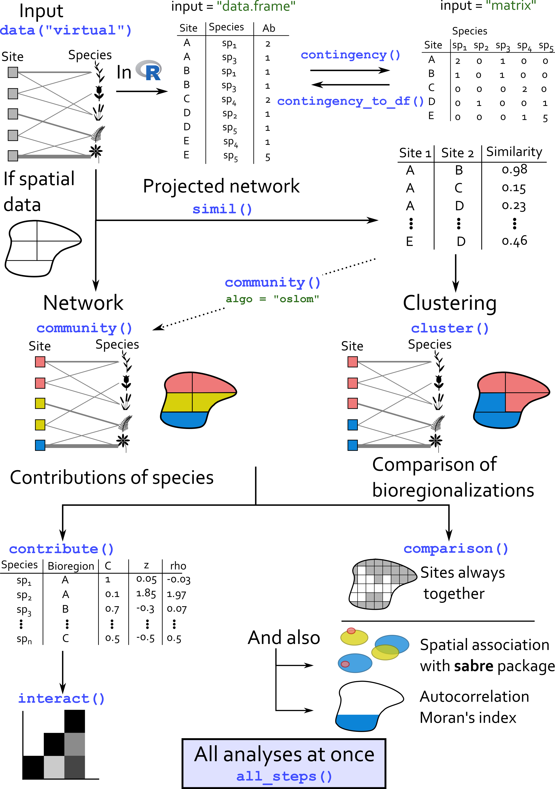

<style>
body {
text-align: justify}
</style>

# 1. Overview

In the following vignette, we show how `bioRgeo` package works. We use a simulated dataset of virtual species distributed across sites to illustrate how we can detect communities, i.e. groups of sites that are closely related regarding their species composition.

To detect these large-scale communities, `bioRgeo` uses a variety of methods, ranging from bipartite network modularity to classical clustering. Each method enables identifying groups of sites that are more similar between each other than compared with the rest of the sites available.

Our example and package is mostly designed for ecologists interested in detecting large-scale patterns in the distribution of species across environments but it can also be used in other fields interested in the detection of large-scale patterns.

The principle of the package is illustrated by the following figure.

```{r package_scheme, fig.label = "Workflow of the package."}

```

\newpage

## 1.1. Glossary
Four types of formats are used in the package.

*contingency matrix*  
a matrix containing the distribution of species across sites. The species are in columns and the sites in rows. The matrix can either contain presences/absences or abundances of species within sites.  
This object is the first possible input of the `bioRgeo` functions.

*long format table*  
a data.frame in which each row indicates the occurrence of a species in a given site. The sites are therefore replicated as many times as the number of species they contain. A third column containing the abundances of species can be added. Without this column, every species present in this table is supposed to be present in the associated site.  
This format is the second possible input of the `bioRgeo` functions.

*adjacency matrix*  
a square matrix that contains *nm* rowns and columns, with *n* the number of sites and *m* the number of species. Both sites and species are in rows and columns. The matrix can be divided into four parts, the top-left corner being the contingency matrix. The bottom-right corner is the transposed contingency matrix. Since site-species matrix correspond to a bipartite network, there are no links between the same type of nodes. This means that there are no links between pairs of sites or between pairs of species. Top-right and bottom-left parts of this matrix are thus filled with 0.  
For more details, see [here](https://en.wikipedia.org/wiki/Adjacency_matrix).

*distance matrix* 
a square matrix containing the distances between each pairs of a set. In `bioRgeo`, we evaluate how pairs of sites are distant to each other regarding their species composition. Different distances can be computed.  
This type of matrix is usually stored as a `dist` object in R.

*bipartite network*
a network, or graph, is an object composed of nodes, or vertices, and links, or edges. Each node is connected with other nodes via some links. In a bipartite network, there are two types of nodes. Each type of node can only be linked with the other type.
Bipartite networks are therefore another way to describe contingency matrices as shown in the next figure. Sites and species constitute the two types of nodes of the network. Occurrences of species within sites are the links of the network.

```{r sitespmat_bip, fig.label = "Equivalence of contingency table and bipartite network."}
knitr::include_graphics("../figures/20200915_sitespmatrix_bipartitenetwork.png")
```

Since `bioRgeo` relies on two possible inputs, we let the option to users to switch from one format to the other using either `contingency()` or `contingency_to_df()` functions as illustrated in the following figure: 

```{r input_figure, fig.label = "Two possible inputs.", fig.width = 4, fig.height = 4}
knitr::include_graphics("../figures/20200225_bioRgeo_inputs.png")
```

Several functions of the package necessitate to define the structure of the input.

```{r setup, include=FALSE}

knitr::opts_chunk$set(echo = TRUE, message = FALSE, warning = FALSE,
                      fig.width = 8, fig.height = 8)
# Packages --------------------------------------------------------------------
suppressPackageStartupMessages({
  suppressWarnings({
    library(bioRgeo)
    library(dplyr)
    library(sf)
    library(ggplot2)
    library(cowplot)
    library(igraph)
    library(RColorBrewer)
  })
})

options(tinytex.verbose = TRUE)

```

\newpage

## 1.2 Virtual dataset
To illustrate how `bioRgeo` works, we use a virtual dataset. This dataset comes with the installation of the package and can be loaded using the following command:

```{r loading_virtual_data}
data("virtual")
head(virtual)
```

This command loads an object called `virtual` containing a virtual dataset. This dataset comes as a `data.frame` with 40000 rows and 9 columns. Important columns are 'sp' containing the species occurrences, 'x' and 'y' the two-dimension coordinates of the sites, 'site' which contains the sites where the species occur, 'pa' for presence/absence. The other columns refer to the construction of the virtual data. More details are given below.   

The virtual dataset has been constructed by simulating the response curves of 100 species to a virtual raster.  
The virtual raster contains 10000 cells and was simulated using `gstat` R package. See [here](http://santiago.begueria.es/2010/10/generating-spatially-correlated-random-fields-with-r/) for details.  

After loading the virtual data, and since each site has XY coordinates, we can plot the raster of the virtual environment layer.

```{r plot_virtual_raster, fig.width = 4, fig.height = 4}
# Plot of environmental values
virtual %>%
  distinct(site, .keep_all = TRUE) %>%
  ggplot(aes(x, y)) +
  geom_tile(aes(fill = env, color = env),
            alpha = 0.8, width = 1, height = 1) +
  scale_color_distiller("Value", palette = "RdYlBu") +
  scale_fill_distiller("Value", palette = "RdYlBu") + #OrRd
  coord_equal() +
  labs(title = "Environmental raster") +
  theme(panel.background = element_rect(fill = "transparent", colour = NA))

```

Based on this raster, we used the `virtualspecies` R package [(Leroy et al. 2015)](https://doi.org/10.1111/ecog.01388) to simulate a Gaussian response curve of 100 virtual species. The mean and standard deviation of the response function varied among species, drawing a continuum of generalist and specialist species.  

The following figure illustrates a response curve for one virtual species:

```{r virtual_sp_response_curve, fig.label = "Example of response curve for one virtual species."}
knitr::include_graphics("../figures/sp_response_curve_example.jpeg")
```

For every species in every cell, we could derive a suitability index and produce suitability maps as shown below.  
Species with suitability index inferior to 0.15 were arbitrarily set absent.

```{r virtual_sp_map, fig.label = "Example of suitability map for one virtual species."}
knitr::include_graphics("../figures/sp_suitability_example.jpeg")
```

In total, the 100 suitability maps of our virtual species are distributed like this:
```{r 100_suitabilities, fig.label = "100 suitability maps for the virtual species."}
knitr::include_graphics("../figures/100_suitability.jpeg")
```

See [here](http://borisleroy.com/virtualspecies/) for further information on the `virtualspecies` R package.

\newpage

### 1.2.1. Code to generate the virtual data
The code to generate the virtual dataset is provided in the chunk below. This chunk is not run when loading the vignette, since the outputs are directly stored with the package.

```{r virtual_dataset, eval = FALSE}
library(gstat) # virtual rasters with autocorrelation
library(sp) # spatial plots
library(cowplot) # combining plots
library(ggplot2) # plot
library(raster)
library(virtualspecies) # simulate virtual species
library(dplyr)
library(bioRgeo)

## Virtual raster layer -------------------------------------------------------
# http://santiago.begueria.es/2010/10/generating-spatially-correlated-random-fields-with-r/

# XY coordinates
xy <- expand.grid(1:20, 1:20)
names(xy) <- c("x","y")
# Spatial model
g_ex <- gstat(formula = z ~ 1 + x + y, locations = ~ x + y, dummy = TRUE,
              beta = c(1, 0.01, 0.005), nmax = 20,
              model = vgm(psill = 0.025, range = 50, model = "Exp"))

# Four layers created
set.seed(1)
yy <- predict(g_ex, newdata = xy, nsim = 4)

# Plottind rasters
gridded(yy) = ~x+y

plot_grid(spplot(obj = yy[1]), spplot(obj = yy[2]),
          spplot(obj = yy[3]), spplot(obj = yy[4]),
          nrow = 2)

# Data.frame with pixel and environmental value
env_dat <- cbind(yy[2]@coords, yy[2]@data)
env_dat$site <- paste0("site", 1:nrow(env_dat))

colnames(env_dat) <- c("x", "y", "env", "site")

# Environmental raster
env_raster <- env_dat[, c("x", "y", "env")]
coordinates(env_raster) <- ~ x + y
gridded(env_raster) <- TRUE
env_raster <- raster(env_raster)

## Virtual species ------------------------------------------------------------
# http://borisleroy.com/files/virtualspecies-tutorial.html

# Generating 100 species with mean all along Bio1 gradient
env_value <- env_dat$env
mean_gdt <- sort(rep(seq(min(env_value), max(env_value), length.out = 10),
                     10))
sd_gdt <- rep(seq(var(env_value), 2*var(env_value), length.out = 10), 10)

# Generating 100 species with 500 occurrences
sampled_points <- rep(500, length(env_dat$env))

# Example of response curve
param_i <- formatFunctions(
  env = c(fun = "dnorm", mean = mean_gdt[1], sd = sd_gdt[100]))
# Generation of the virtual species
sp_i <- generateSpFromFun(raster.stack = env_raster,
                          parameters = param_i, plot = TRUE)
plotResponse(sp_i)

# Loop to generate the occurrences of 100 species
virtual <- c()
for (i in 1:100){
  param_i <- formatFunctions(
    env = c(fun = "dnorm", mean = mean_gdt[i], sd = sd_gdt[i]))
  # Generation of the virtual species
  sp_i <- generateSpFromFun(raster.stack = env_raster,
                            parameters = param_i, plot = TRUE)
  # plotResponse(sp_i)
  
  # Conversion to presence/absence
  pa_i <- convertToPA(sp_i, plot = FALSE, beta = 0.7)
  
  occ_i <- data.frame(sp = paste0("sp", i),
                      rasterToPoints(pa_i$suitab.raster),
                      pa = data.frame(rasterToPoints(pa_i$pa.raster))$layer)
  colnames(occ_i)[colnames(occ_i) == "layer"] <- "suitab"
  
  # Binding results
  virtual <- rbind(virtual, occ_i)
  print(i)
}

# Add site and environment columns
virtual <- left_join(virtual, env_dat, by = c("x", "y"))
```

\newpage

# 2. Community detection
The core of `bioRgeo` relies on the aggregation of several methods that
perform community detection.  

Before applying any of the available method, and according to the preference of the user, we can convert the input data.frame into a contingency table, using the `contingency()` function.  
This transformation can consider the abundances of species.

```{r contingency_matrix}
sp_mat <- contingency(virtual[which(virtual$pa != 0), ],
                      "site", "sp", ab = NULL, weight = FALSE)
knitr::kable(sp_mat[1:5, 1:5],
             caption = "5 first rows and columns of contingency table.")

# With weights (abundances of species within sites)
sp_mat_w <- contingency(virtual, "site", "sp", ab = "suitab", weight = FALSE)
knitr::kable(sp_mat_w[1:5, 1:5],
             caption = "5 first rows and columns of weighted contingency
             table.")
```

Available methods can be classed among three main groups: distance-based clustering, projected networks and bipartite networks.

\newpage

## 2.1. Distance matrix
Most of the methods available in `bioRgeo` package, either clustering or network techniques, rely on the projection of the contingency matrix. Projecting the contingency matrix means creating a distance matrix from the contingency table, i.e. evaluating how pairs of sites are different regarding their species compositions.  

`simil()` function allows projecting the contingency table into a distance matrix. Several similarity metrics can be used to evaluate the distances between each pair of sites.  

Most of the similarity metrics deal with presence/absence data only. To take into account the abundances of species, Bray-Curtis or Euclidean distances can be used.  

As shown in the chunk of code below, the function `simil()` can accept and return both data.frame and matrix.  
```{r projection}
sp_proj <- simil(sp_mat, metric = "simpson")

knitr::kable(head(sp_proj))

# With data frame input
sp_proj_df <- simil(virtual[which(virtual$pa != 0), ],
                    metric = "simpson", input = "data frame",
                    site = "site", sp = "sp")
identical(sp_proj, sp_proj_df)
rm(sp_proj_df)

# With matrix output
sp_proj_mat <- simil(virtual[which(virtual$pa != 0), ],
                     metric = "simpson", input = "data frame",
                     site = "site", sp = "sp", output = "matrix")
dim(sp_proj_mat); sp_proj_mat[1:5, 1:5]

sp_proj_dist <- simil(sp_mat, metric = "bray", output = "dist")
str(sp_proj_dist)

# Bray-Curtis dissimilarity can take into account abundances of species
sp_proj_w <- simil(sp_mat_w, metric = "bray")

knitr::kable(head(sp_proj_w))

```

\newpage

## 2.2. Clustering

Clustering techniques aim at partitionning *n* observations into
*k* clusters. They can be divided in supervised and unsupervised algorithms.  

If the algorithm used is unsupervised, it will identify on its own how many groups structure the data.  
When using supervised algorithms, the user needs to tell how many groups are expected to be found in the data. In that case, optimizations algorithms can help the users to decide how many groups should structure the data.

`bioRgeo` contains a function \code{**cluster()**} that gathers several classical methods of clustering. Some available methods are based on a distance matrix. When using these methods, you can directly provide the output of `simil()` function. If you feed `cluster()` with a long-format table, `cluster()` will compute a distance matrix based on *Simpson* dissimilarity metric.  
Available methods are directly imported from existing packages (\code{cluster}, \code{dbscan}, \code{dendextend}, \code{fastcluster}, \code{mclust}, \code{meanShiftR} and \code{stats}).  

Available unsupervised algorithms are the following: *meanshift*, *dbscan* and *gmm*.  

Available supervised algorithms are the following:
*kmeans* and *pam* and the so-called Agglomerative Hierarchical Clustering methods: *ward.D*, *ward.D2*, *single*, *complete*, *average*, *mcquitty*, *median*, *centroid* and *diana*.  

Agglomerative Hierarchical Clustering starts by assigning each data point to a singleton cluster. It then joins iteratively the two clusters that have the minimal distance among all pairwise distances into a bigger cluster. This step is then repeated until each data point belongs to the same big cluster. This procedure creates a tree where each branching splits the data in two different groups.  
The choice of the agglomerative clustering method affects the calculation of the minimal distance between sets of points.  
Since the user has to decide where to cut the tree, all the agglomerative hierarchical clustering methods are supervised algorithm.  

When using a supervised algorithm with no clue about the optimal number of clusters, we can use an optimization procedure maximising a silhouette index.
Quick description of Silhouette. They come with optimization procedures to identify the optimal number of clusters. These optimization methods are the following:
*globalmax*, *firstmax*, *Tibs2001SEmax*, *firstSEmax* or *globalSEmax*.  

The [vignette](https://cran.r-project.org/web/packages/fastcluster/vignettes/fastcluster.pdf) of \code{fastcluster} package provides further details about some of the available methods.  

```{r cluster_methods}

knitr::kable(data.frame(
  Acronym = c("kmeans", "pam", "meanshift", "dbscan", "gmm",
              "ward.D", "ward.D2",
              "single", "complete", "average",
              "mcquitty", "median", "centroid", "diana"),
  Method = c(
    "K-Means", "Partitioning Around Medoids", "Mean-Shift",
    "Density-Based Spatial Clustering of Applications with Noise",
    "Gaussian Mixture Models",
    "Ward.D", "Ward.D2",
    "single", "complete",
    "Unweighted pair-group method using arithmetic averages (UPGMA, average linkage)",
    "Weighted pair-group method using arithmetic averages (WPGMA, McQuitty’s method)",
    "Weighted pair-group method using centroids (WPGMC, median linkage)",
    "Unweighted pair-group method using centroids (UPGMC, centroid linkage)",
    "DIvisive ANAlysis Clustering"),
  Category = c(rep("Partitionning", 5), rep("Hierarchical", 9)),
  Supervision = c("Yes", "Yes", "No", "No", "No", rep("Yes", 9)),
  `Short description` = c(
    "kmeans",
    "pam",
    "meanshift",
    "dbscan",
    "gmm",
    "Uses an ANOVA approach and minimizes the sum of squares of any two clusters thatcan be formed at each step",
    "ward.D2",
    "single",
    "complete",
    "Distance between two clusters is the average distance between all objects of each cluster",
    "Distance between two clusters is the arithmetic average distance between objects ofeach cluster weighted by the number of objects in each cluster",
    "Distance between two clusters is the Euclidean distance between their weightedcentroids",
    "Distance between the centroids (‘mean point’ or centre of gravity) of each cluster",
    "Starting with all observations forming one single large cluster, groups are repeatedlydivided until each cluster contains only a single observation. At each stage, thecluster with the largest diameter in terms of the maximum observed dissimilarity isselected (Kaufman & Rousseeuw, 1990)"),
  `Source R package` = c("stats", "cluster", "meanShiftR", "dbscan", "mclust",
                         rep("fastcluster", 8), "cluster")))
```

The next chunk computes the different clustering methods on the virtual data.

```{r cluster}
# CA_res <- CA_cluster(sp_mat)
km_res <- cluster(sp_mat, method = "kmeans", n_clust = 4)

# With dist input
sp_proj_euc <- simil(sp_mat, metric = "euclidean", output = "dist")
km_res <- cluster(sp_proj_euc, method = "kmeans", n_clust = 4)

pam_res <- cluster(sp_mat, method = "pam", n_clust = 4)

mshift_res <- cluster(sp_mat, method = "meanshift")

dbscan_res <- cluster(sp_mat, method = "dbscan")

gmm_res <- cluster(sp_mat, method = "gmm")

ward_res <- cluster(sp_mat, method = "ward.D", n_clust = 4)
ward2_res <- cluster(sp_mat, method = "ward.D2", n_clust = 4)
single_res <- cluster(sp_mat, method = "single", n_clust = 4)
complete_res <- cluster(sp_mat, method = "complete", n_clust = 4)
average_res <- cluster(sp_mat, method = "average", n_clust = 4)
mcquitty_res <- cluster(sp_mat, method = "mcquitty", n_clust = 4)
# median_res <- cluster(sp_mat, method = "median", n_clust = 4) # BUG
centroid_res <- cluster(sp_mat, method = "centroid", n_clust = 4)

diana_res <- cluster(sp_mat, method = "diana", n_clust = 4)

```

\newpage

## 2.3. Network and community detection

A second 'family' of methods exist to classify sites that are more similar to each other regarding their species' composition. The site-species matrix can be described as a **bipartite network** (see Glossary). On networks, modularity algorithm can be applied to detect community structure. Communities are made of sets of nodes that share more links between each other than within the other nodes of the network. Maximising the modularity metric therefore enables to find the groups of sites and species that are related to each other. Bioregions therefore correspond to the different modules of the network.  

Some methods, like OSLOM, rely upon projected networks, i.e. distance matrices (see Glossary). In that case, the similarity between each pair of nodes is evaluated. Similarity is evalaluated by the proportion of species each pair of sites share together.  

All the following methods are non parametric in the sense that they identify the statistically significant partition, without defining the number of  communities a priori. However, some parameters can be adjusted to refine/coarsen the partitions.

Several methods exist and are available in `bioRgeo`. They are briefly described in the following table.
In our case, every method applies on bipartite networks but most of the following methods rely on the construction of a square adjacency matrix (see Glossary). We therefore classify these algorithms as 'unipartite' in the following table.

```{r network_methods}
knitr::kable(data.frame(
  Acronym = c("greedy", "betweenness", "walktrap", "louvain", "spinglass",
              "leading_eigen", "label_prop", "beckett", "quanbimo",
              "netcarto", "oslom", "infomap"),
  Method = c("Fast greedy optimization of modularity",
             "Betweenness", "Walktrap", "Louvain", "Spinglass",
             "Leading eigenvector", "Label propragation",
             "Beckett (LPAwb+)", "Quantitative bipartite network", "netcarto",
             "Order Statistics Local Optimization Method", "Infomap (map equation)"),
  Category = c(rep("Unipartite", 11), rep("Bipartite", 1)),
  `Short description` = c(
    "Recurrently merging communities that maximise modularity function",
    "Divisive algorithm. Edges connecting separate modules have high edge betweenness as all the shortest paths from one module to another must traverse through them. Gradually remove the edge with the highest edge betweenness score to get a dendrogram of the graph",
    "Agglomerative algorithm merging similar nodes/communities recursively through random walks",
    "Fast modularity optimization",
    "Modularity optimization through simulated annealing",
    "Modularity optimization",
    "Each node is initialized with a unique label and at every iteration of the algorithm, each node adopts a label that a maximum number of its neighbors have, with ties broken uniformly randomly. As the labels propagate through the network in this manner, densely connected groups of nodes form a consensus on their labels. At the end of the algorithm, nodes having the same labels are grouped together as communities.",
    "Two stages: a ‘bottom up’ step that maximizes modularity on a node-by-node basis using label propagation; and a ‘top down’ step that joins modules together when it results in increased network modularity.",
    "Hierarchical random graph: builds a graph and then randomly swaps branches at any level and evaluates whether the new graph is more likely than the previous one, recording and updating the best graph. The swapping is a Simulated Annealing-Monte Carlo approach.",
    "Modularity maximisation with simulated annealing",
    "Iterative process to detect statistically significant communities with respect to a global null model.",
    "Optimization of the Map Equation."),
  `Source R package` = c(
    rep("igraph", 7), rep("bipartite", 2), "rnetcarto", 
    "none (code compiled from oslom.org)",
    "none (code compiled from https://www.mapequation.org)"),
  References = c("Clauset et al., 2011", "Newman & Girvan, 2011",
                 "Pons & Latapy, 2005", "Blondel et al., 2008",
                 "Reichardt & Bornholdt, 2006", "Newman, 2006",
                 "Raghavan et al., 2006","Beckett, 2016",
                 "Dormann & Strauss, 2014", "Guimerà & Amaral, 2005", 
                 "Lancichinetti et al., 2010", "Rosvall et al., 2009")))

```

\newpage
The next chunk runs the different network methods on the virtual dataset.  

```{r network}
# With fastgreedy
bip <- community(dat = sp_mat, algo = "greedy", weight = FALSE)

# fastgreedy, input data frame
bip_df <- community(dat = virtual[which(virtual$pa > 0), ],
                    algo = "greedy",
                    weight = FALSE, input = "data frame", site = "site",
                    sp = "sp", ab = NULL)

table(bip$module); table(bip_df$module)

# With Beckett algorithm
bip_beckett <- community(dat = sp_mat, algo = "beckett", weight = FALSE)

# With Louvain
bip_louvain <- community(dat = sp_mat, algo = "louvain", weight = FALSE)

# With Walktrap
bip_walktrap <- community(dat = sp_mat, algo = "walktrap", weight = FALSE)

# Only sites
bip_site <- bip %>%
  filter(cat == "site") %>%
  rename(site = node) %>%
  dplyr::select(site, module)

bip_site_beckett <- bip_beckett %>%
  filter(cat == "site") %>%
  rename(site = node) %>%
  dplyr::select(site, module)

bip_site_louvain <- bip_louvain %>%
  filter(cat == "site") %>%
  rename(site = node) %>%
  dplyr::select(site, module)

bip_site_walktrap <- bip_walktrap %>%
  filter(cat == "site") %>%
  rename(site = node) %>%
  dplyr::select(site, module)

# OSLOM
oslom_mod <- community(
  dat = sp_proj[which(sp_proj$simpson> 0), ], algo = "oslom", weight = FALSE,
  input = "data frame", site = "site", sp = "sp", N = 10,
  n_runs = 1, t_param = 0.1, cp_param = 0.5, hr = 0,
  oslom_id1 = "id1", oslom_id2 = "id2", oslom_proj = "simpson")

cat(paste0("Number of bioregions detected = ",
           length(unique(oslom_mod$bioregion))))

# The following sites have been associated to several bioregions
table(oslom_mod$site)[table(oslom_mod$site) > 1]

# Infomap
infomap_mod <- community(
  dat = virtual[which(virtual$pa > 0), ], algo = "infomap", weight = FALSE,
  input = "data frame", site = "site", sp = "sp",
  N = 10)

infomap_site <- infomap_mod %>%
  filter(cat == "site") %>%
  rename(site = node) %>%
  dplyr::select(site, module)

# Add modularity/likelihood statistics as an ouput for some algorithms
# Add CA (Correspondence Analysis)
# check cluster_ward

```

*Warning*
OSLOM algorithm sometimes classifies sites into several bioregions. If you want to have only one bioregion associated to each site, a reclassification of the doublons has to be done.
This reclassification can use the species contributions of the problematic sites (see later).

\newpage

# 3. Comparison
In this section, we compare the different bioregionalizations obtained with the distinct methods.  
We first compare the time necessary to compute the different groups by performing a `microbenchmark`.  

Then, since each site has XY coordinates, we look at the spatial outputs of the different bioregionalizations.  

We then identify the sites classed together in every bioregionalization method.  

Finally, we look at how each pair of bioregionalization can be compared with the [`sabre` R package()](https://cran.r-project.org/web/packages/sabre/vignettes/sabre.html) and how the autocorrelation within one bioregionalization can be quantified with Moran's index.

\newpage

## 3.1. Microbenchmark
The following `microbenchmark` provides a comparison of the different methods available in `bioRgeo` in terms of computation time.

```{r microbenchmark, eval = FALSE}
require(microbenchmark)

mbm <- microbenchmark(
  # cluster methods
  km = cluster(sp_mat, method = "kmeans", n_clust = 4),
  pam = cluster(sp_mat, method = "pam", n_clust = 4),
  mshift = cluster(sp_mat, method = "meanshift"),
  dbscan = cluster(sp_mat, method = "dbscan"),
  gmm = cluster(sp_mat, method = "gmm"),
  ward = cluster(sp_mat, method = "ward.D", n_clust = 4),
  ward2 = cluster(sp_mat, method = "ward.D2", n_clust = 4),
  single = cluster(sp_mat, method = "single", n_clust = 4),
  complete = cluster(sp_mat, method = "complete", n_clust = 4),
  average = cluster(sp_mat, method = "average", n_clust = 4),
  mcquitty = cluster(sp_mat, method = "mcquitty", n_clust = 4),
  # median = cluster(sp_mat, method = "median", n_clust = 4), # BUG
  centroid = cluster(sp_mat, method = "centroid", n_clust = 4),
  diana = cluster(sp_mat, method = "diana", n_clust = 4),
  # network methods
  fastgreedy = community(dat = sp_mat, algo = "greedy", weight = FALSE),
  beckett = community(dat = sp_mat, algo = "beckett", weight = FALSE),
  louvain = community(dat = sp_mat, algo = "louvain", weight = FALSE),
  walktrap = community(dat = sp_mat, algo = "walktrap", weight = FALSE),
  oslom = oslom(sp_proj[which(sp_proj$simpson > 0), ], n_runs = 5,
                t_param = 0.1, cp_param = 0.5),
  infomap = community(dat = virtual[which(virtual$pa > 0), ], algo = "infomap",
                      weight = FALSE, input = "data frame", site = "site",
                      sp = "sp", N = 10),
  # number of times for each algorithm
  times = 10)#50)

```

```{r microbenchmark_plot}
mbm <- readRDS("../figures/20200923_microbenchmark_times10.rds")

# Order microbenchmark by time
mbm_plot <- as.data.frame(mbm)

#Plot
ggplot(mbm_plot, aes(reorder(expr, time, na.rm = TRUE), time)) +
  geom_boxplot(aes(fill = as.factor(expr))) +
  scale_y_continuous(trans = "log") +
  scale_fill_viridis_d("Method") +
  labs(x = "Methods", y = "Time (log-transformed ms)") +
  theme_classic() +
  theme(panel.border = element_rect(fill = "NA"))

```

On a bipartite network made of 400 sites and 100 species, the fastest algorithm is the Louvain algorithm. Many algorithms show similar performances. Mean-shift and OSLOM algorithms are the slowest ones.  

\newpage

## 3.2. Maps
If sites have coordinates, we can apply several functions to compare how the distinct bioregions are segregated through space.

```{r map_virtual_dataset_tidy}
# Remove doublons in OSLOM classification (random assignment)
oslom_mod <- oslom_mod[!duplicated(oslom_mod$site), ]

# Tidy dataset
bio_maps <- virtual %>%
  distinct(site, .keep_all = TRUE) %>% # remove duplicates per site
  dplyr::select(-suitab, -pa, -opt, -width) %>% # removing useless columns
  left_join(km_res, by = "site") %>% # add kmeans
  rename(cluster_km = cluster) %>%
  left_join(mshift_res, by = "site") %>% # add meanshift
  rename(cluster_mshift = cluster) %>%
  left_join(oslom_mod, by = "site") %>% # add oslom
  rename(cluster_oslom = bioregion) %>%
  left_join(ward_res, by = "site") %>% # add ward
  rename(cluster_ward = cluster) %>%
  left_join(dbscan_res, by = "site") %>% # add dbscan
  rename(cluster_dbscan = cluster) %>%
  left_join(gmm_res, by = "site") %>% # add gmm
  rename(cluster_gmm = cluster) %>%
  left_join(pam_res, by = "site") %>% # add pam
  rename(cluster_pam = cluster) %>%
  left_join(diana_res, by = "site") %>% # add diana
  rename(cluster_diana = cluster) %>%
  left_join(bip_site, by = "site") %>% # add fastgreedy
  rename(cluster_fastgreedy = module) %>%
  left_join(bip_site_beckett, by = "site") %>% # add lpawb
  rename(cluster_beckett = module) %>%
  left_join(infomap_site, by = "site") %>% # add infomap
  rename(cluster_infomap = module) %>%
  left_join(bip_site_louvain, by = "site") %>% # add louvain
  rename(cluster_louvain = module) %>%
  left_join(bip_site_walktrap, by = "site") %>% # add walktrap
  rename(cluster_walktrap = module) %>%
  tidyr::gather(mod, val, contains("cluster")) %>% # tidy
  as.data.frame()

# Plot with facetting
ggplot(bio_maps, aes(x, y)) +
  geom_tile(aes(fill = as.factor(val), color = as.factor(val)),
            alpha = 0.8, width = 1, height = 1) +
  scale_color_brewer("Bioregions", palette = "Paired") +
  scale_fill_brewer("Bioregions", palette = "Paired") +
  coord_equal() +
  labs(title = "Bioregionalizations") +
  theme_classic() +
  theme(panel.background = element_rect(fill = "transparent", colour = NA)) +
  facet_wrap(~ mod)

```

\newpage

## 3.3. Coherent areas

This part aims at identifying the sites all the time gathered together.

`comparison` function returns for each site, the percentage of same classification with all the other sites for all the bioregionalizations.
The equation for the site $f$ is the following:

$$
Concordance_f = 100\times\frac{\sum^M_{i=1}\sum^{n-1}_{j=1}j_i = f_i}{M}
$$

with $M$ the number of bioregionalization methods used and $n$ the number of sites.

```{r comparison}
# Spreading the format of bio_maps: one column per bioregionalization
bio_maps2 <- tidyr::spread(bio_maps, mod, val)

# Test of comparison function
all100 <- comparison(bio_maps2, site = "site",
                     bio_col = c(6:ncol(bio_maps2)), output = "both")

lapply(all100, dim)
head(all100[[2]])

# Plot of fully concordant areas
all100[[2]] %>%
  left_join(bio_maps[, c("site", "x", "y")], by = c("id" = "site")) %>%
  distinct(id, .keep_all = TRUE) %>%
  ggplot(aes(x, y)) +
  geom_tile(aes(fill = as.factor(uni), color = as.factor(uni)),
            alpha = 0.8, width = 1, height = 1) +
  scale_color_viridis_d("Bioregions", option = "E") +
  scale_fill_viridis_d("Bioregions", option = "E") +
  coord_equal() +
  labs(title = "Identical bioregions") +
  theme_classic() +
  theme(panel.border = element_rect(fill = NA))
```

\newpage

We can also plot the concordance across the bioregionalizations for one site only. We here look at the site 103.

```{r comparison_onesite}
# Plot percentage of concordance for one site only
site103 <- reshape2::melt(all100[[1]])
colnames(site103) <- c("id1", "id2", "perc")
# Remove NAs
site103 <- site103[complete.cases(site103), ]
# Only site 103
site103 <- site103[which(site103$id1 == "site103" |
                           site103$id2 == "site103"), ]

site103 <- rbind(
  data.frame(
    site = site103[which(site103$id1 == "site103"), "id2"],
    perc = site103[which(site103$id1 == "site103"), "perc"]),
  data.frame(
    site = site103[which(site103$id2 == "site103"), "id1"],
    perc = site103[which(site103$id2 == "site103"), "perc"]))

# Adding coordinates
site103 <- left_join(site103,
                     virtual[!duplicated(virtual$site), c("site", "x", "y")],
                     by = "site")

coord103 <- distinct(virtual[which(virtual$site == "site103"),
                           c("site", "x", "y")])

# Plot
ggplot(site103, aes(x, y)) +
  geom_tile(aes(fill = perc, color = perc),
            alpha = 0.8, width = 1, height = 1) +
  geom_tile(data = coord103, color = "black", fill = "black") +
  scale_color_distiller("Concordance (%)", palette = "OrRd",
                        direction = 1) +
  scale_fill_distiller("Concordance (%)", palette = "OrRd",
                       direction = 1) +
  coord_equal() +
  labs(title = "Site 103") +
  theme_classic() +
  theme(panel.border = element_rect(fill = NA))

```

\newpage

## 3.4. Pairs of bioregionalizations
We can as well compare each pair of bioregion to each other using [`sabre`](https://cran.r-project.org/web/packages/sabre/vignettes/sabre.html) package.

We here provide an example of how the `sabre::vmeasure_calc()` function can give insight about the spatial association between a pair of bioregionalization.

```{r pair_bioregions}
# Only two bioregionalizations selected
pair_bio <- bio_maps2[, c("site", "x", "y", "cluster_beckett",
                          "cluster_fastgreedy")]

table(pair_bio$cluster_beckett, pair_bio$cluster_fastgreedy)

# Create polygons out of coordinate centroids
pair_bio$E_x <- pair_bio$x - 0.5
pair_bio$W_x <- pair_bio$x + 0.5
pair_bio$N_y <- pair_bio$y + 0.5
pair_bio$S_y <- pair_bio$y - 0.5

list_tiles <- lapply(1:nrow(pair_bio), function(x){
  # create a matrix of coordinates that also 'close' the polygon
  res <- matrix(c(pair_bio[x, "W_x"], pair_bio[x, "N_y"],
                  pair_bio[x, "E_x"], pair_bio[x, "N_y"],
                  pair_bio[x, "E_x"], pair_bio[x, "S_y"],
                  pair_bio[x, "W_x"], pair_bio[x, "S_y"],
                  pair_bio[x, "W_x"], pair_bio[x, "N_y"]),
                ncol = 2, byrow = TRUE)
  # create polygon objects
  st_polygon(list(res))
})

pair_bio2 <- st_sf(site = pair_bio[, "site"], st_sfc(list_tiles))
# plot(pair_bio2)

# sabre package: Spatial Association Between REgionalizations
library(sabre)
library(sf)

pair_sf <- st_sf(site = pair_bio[, "site"],
                 st_sfc(list_tiles)) %>%
  left_join(pair_bio[, c("site", "cluster_beckett")], by = "site") %>%
  group_by(cluster_beckett) %>%
  summarise()

pair_sf2 <- st_sf(site = pair_bio[, "site"],
                  st_sfc(list_tiles)) %>%
  left_join(pair_bio[, c("site", "cluster_fastgreedy")], by = "site") %>%
  group_by(cluster_fastgreedy) %>%
  summarise()

plot_grid(
  ggplot(pair_sf) +
    geom_sf(aes(fill = as.factor(cluster_beckett))) +
    scale_fill_brewer("Beckett", palette = "Paired"),
  ggplot(pair_sf2) +
    geom_sf(aes(fill = as.factor(cluster_fastgreedy))) +
    scale_fill_brewer("Fastgreedy", palette = "Paired")
)

# Vmeasure of the two selected bioregionalizations
vmeasure_calc(x = pair_sf, x_name = cluster_beckett,
              y = pair_sf2, y_name = cluster_fastgreedy)
```

\newpage

## 3.5. Moran autocorrelation

We here provide a chunk of code to evaluate the spatial autocorrelation of a given bioregionalization using Moran index (Moran, 1948).

```{r autocorrelation, eval = TRUE}
## Autocorrelation
# https://mgimond.github.io/Spatial/spatial-autocorrelation-in-r.html
library(sp)

bio_maps_moran <- bio_maps2
# Convert bioregions into numeric
bio_names <- paste0("cluster_", c("beckett", "dbscan", "diana",
                                  "fastgreedy", "gmm", "infomap", "km",
                                  "louvain", "mshift", "oslom", "pam",
                                  "walktrap", "ward"))
bio_maps_moran[bio_names] <- sapply(bio_maps_moran[bio_names],
                                    as.numeric)
# Coordinates of the sites
coordinates(bio_maps_moran) <- ~ x + y
coo <- coordinates(bio_maps_moran)
# Bandwidth used: number of nearest neighbours for the calculation of
# the weights
bws <- c(2, 3, 9, 27)

# List of Moran autocorrelation
moran_df <- c()
for(i in 1:length(bio_names)){
  tmp <- as.data.frame(
    lctools::moransI.v(
      coo, bws, bio_maps_moran@data[, bio_names[i]], plot = FALSE))
  
  tmp$method <- bio_names[i]
  
  # Binding results
  moran_df <- rbind(moran_df, tmp[, c("method", "k", "Moran's I")])
}

ggplot(moran_df, aes(k, `Moran's I`)) +
  geom_line(aes(color = as.factor(method))) +
  geom_point(aes(color = as.factor(method))) +
  scale_color_viridis_d("Method") +
  labs(title = "Comparison of bioregionalization",
       x = "Number of neighbours", y = "Moran's I") +
  theme_classic() +
  theme(panel.border = element_rect(fill = NA, color = "black"))

```

GMM method gives the highest spatial autocorrelation according to Moran'I index.

\newpage

# 4. Species' contributions

Once a relevant bioregionalization has been identified, we can evaluate how the species are distributed within and across the different bioregions. Since sites belong to different bioregions, species can occur in sites of one or several bioregions. Therefore, one species can contribute a lot to the construction of one particular bioregion or, reverse, dilute its occurrences in many different assemblages.  

This part aims at evaluating the contributions of species to the different bioregions created. Contribution can be measured in several ways. A first index, the $\rho$ score proposed by [Lenormand et al. (2019)](https://doi.org/10.1002/ece3.4718) measures per species in many bioregions are distributed the sites in which it occurs. The following figure illustrates how this $\rho$ score is calculated:

```{r zscore_scheme, fig.label = "Principle of the zscore calculation."}

```

The formula to compute the contribution of a species $i$ in the bioregion $j$ is the following:

$$
\rho_{ij} = \frac{n_{ij} - \frac{n_in_j}{n}}{\sqrt(\frac{n-n_j}{n-1}(1-\frac{n_j}{n})\frac{n_jn_i}{n})}
$$

with $n$ the total number of sites, $n_i$ the number of sites in which species $i$ occurs, $n_j$ the number of sites belonging to the bioregion $j$ and $n_{ij}$ the number of sites belonging to the bioregion $j$ and in which the species $i$ occurs.

The score $\rho_{ij}$ is negative if the species $i$ is under‐represented in region $j$, equal to 0 if the species $i$ is present in region $j$ in the same proportion as in the whole study area, or positive if the species $i$ is over‐represented in region $j$.

\newpage

Based on this contribution score, a bioregion can be associated with each species. The species can belong to the bioregion to which its contribution score is the highest. With some bipartite methods however, both sites and species are classed among bioregions. This is the case for Infomap algorithm for example. In this case, two other indices to evaluate the behaviour of species across bioregions were proposed by [Guimerà & Nunes Amaral (2005)](https://doi.org/10.1038/nature03288). Their two indices are the coefficient of participation $C$ and the intra-module degree $z$. 

The coefficient of participation $C_i$ evaluates for a species $i$ in how many different bioregions than the one it belongs to it occurs. Its formula is the following:

$$
C_{i} = 1 - \sum_{i = 1}^{N_b}{(\frac{k_{is}}{k_{i}})^2} 
$$

where $C_i$ is the participation coefficient of species $i$, $k_{is}$ is the number of links of species $i$ to bioregion $s$, $k_i$ is the total number of links of species $i$ and $N_b$ is the total number of bioregions. This index ranges from 0 (a species that occurs only at sites in its own bioregion) to $1 - 1/N_b$ (i.e. an extreme generalist species).  

The second index proposed by [Guimerà & Nunes Amaral (2005)](https://doi.org/10.1038/nature03288) is the intra-module degree $z$. This index is calculated like this:

$$
z_i = \frac{k_i - \overline{k_{si}}}{\sigma_{k_{si}}}
$$

with $k_i$ the number of sites in its assigned bioregion where species $i$ occurs,
$\overline{k_{si}$ the average number of sites species from the bioregion occur in and $\sigma_{k_{si}$ the standard deviation.  

The intra-module degree $z$ therefore measures how well-connected species $i$ is to other sites in its bioregion compared to the other species of this bioregion.

These two scores can allow to draw a $Cz$ space in which all the species fall into. This space can then be divided in several parts with species having different behavious:  
- periperals: species with low $C$ and $z$ scores. These species only belong to sites of their own bioregion and are pretty rare in it.
- connectors: species with high $C$ and low $z$ scores. These species occur in many bioregions and are pretty rare.
- module hubs: species with low $C$ and high $z$ scores. These species occur in sites of their own bioregion only but are abundant within it.
- network hubs: species with high $C$ and $z$ scores. These species are generalists, broadly distributed across bioregions and abundant in their own.

\newpage

The next chunk illustrates how `contrib()` function returns these 3 indices.

```{r contrib}
# Bioregions for sites obtained with Infomap
infomap_site <- infomap_mod %>%
  filter(cat == "site") %>%
  rename(site = node,
         mod_site = module) %>%
  dplyr::select(site, mod_site)

# Bioregions for species obtained with Infomap
infomap_sp <- infomap_mod %>%
  filter(cat == "sp") %>%
  rename(sp = node,
         mod_sp = module) %>%
  dplyr::select(sp, mod_sp)

# Merging the bioregion identification with long-format data frame
scores_infomap <- left_join(virtual[which(virtual$pa > 0),
                                  c("site", "sp", "x", "y")], 
                            infomap_site, by = "site")
scores_infomap <- left_join(scores_infomap, infomap_sp, by = "sp")

head(scores_infomap)

# Calculation of the species scores
scores <- contribute(dat = scores_infomap,
                     sp_col = "sp", site_col = "site",
                     bioregion_col = "mod_site", bioregion_sp_col = "mod_sp")
```

There is a positive link between $\rho$ and $z$ scores for the species.

```{r contrib_plot}
# Scores of sites only
scores_sites <- scores[!duplicated(scores$sp),
                       c("site", "mod_site", "C_site", "z_site")]

# Scores of species only
scores_sp <- scores[!duplicated(scores$sp),
                    c("sp", "mod_sp", "C_sp", "z_sp", "rho")]

ggplot(scores_sp, aes(rho, z_sp)) +
  geom_point(aes(color = as.factor(mod_sp)), size = 2) +
  scale_color_brewer("Infomap\nbioregion", palette = "Paired") +
  labs(title = "Species scores",
       x = expression(rho), y = "Intra-module degree (z)") +
  theme_classic() +
  theme(panel.border = element_rect(fill = NA, color = "black"))

```

From the $Cz$ scores, we can draw the $Cz$ space. The different categories are dividing the mean of each axis, making four categories.

```{r Cz_space}
scores_sp$C_sp <- as.numeric(as.character(scores_sp$C_sp))

ggplot(scores_sp, aes(C_sp, z_sp)) +
  geom_point(aes(color = as.factor(mod_sp)), size = 2) +
  scale_color_brewer("Infomap\nbioregion", palette = "Paired") +
  geom_vline(xintercept = mean(scores_sp$C_sp)) +
  geom_hline(yintercept = mean(scores_sp$z_sp)) +
  annotate(geom = "label", x = 0, y = -1.5, label = "Peripherals") +
  annotate(geom = "label", x = 0.6, y = -1.5, label = "Connectors") +
  annotate(geom = "label", x = 0, y = 2, label = "Module hubs") +
  annotate(geom = "label", x = 0.6, y = 2, label = "Network hubs") +
  labs(title = "Cz space",
       x = "Participation coefficient (C)", y = "Intra-module degree (z)") +
  theme_classic() +
  theme(panel.border = element_rect(fill = NA, color = "black"))

```

*Note*
Some algorithms (like OSLOM) only classify sites into bioregions and do not assign species to bioregions. In this case, the argument `bioregion_sp_col` is set to `NULL` and the function `contribute()` assign species to a bioregion based on the most frequent bioregion across the sites where the species occurs. 

```{r contrib_proj_oslom}
# Merging the bioregion identification with long-format data frame
scores_oslom <- left_join(virtual[which(virtual$pa > 0),
                                c("site", "sp", "x", "y")], 
                          oslom_mod, by = "site")
head(scores_oslom)

# Calculation of the species scores
scores2 <- contribute(dat = scores_oslom,
                      sp_col = "sp", site_col = "site",
                      bioregion_col = "bioregion", bioregion_sp_col = NULL)
```

\newpage

# 5. Interaction between bioregions

Some of the different bioregions identified by the previous methods are more connected among each other, regarding the species that belong to them, than others. This connection can be quantified for each pair of bioregions by looking at how many species belonging to each bioregion are present in the sites of the other bioregion.  
Specifically, we compute a Sørensen index for each pair of bioregions according the following formula:
$$
\beta_{ij, i \neq j} = \frac{2a}{b + c}
$$
With $i$ and $j$ two distinct bioregions, $a$ the number of species commonly occurring in their sites, $b$ the number of species occurring in bioregion $i$ and $c$ the number of species occurring in bioregion $j$. This index ranks between 0, when no species are shared between two bioregions, and 1, when the species list are identical. 

This index of interactions between the different bioregions is calculated with the `interact()` function. Two graphical options are available with this function. `plot = TRUE` displays a heat map with Sørensen scores obtained for each pair of bioregion. `chord = TRUE` displays a chord diagram showing the strength of connection between each pair of bioregion.  

We here illustrate this function with the bioregions obtained from Infomap algorithm.

```{r interact}
infomap_int <- interact(dat = scores, site = "site", sp = "sp",
                        bio_site = "bio_site", plot = TRUE, chord = TRUE)

# Heatmap
infomap_int[[2]]
```

\newpage

# 6. Run all the steps together

All these previous steps and the corresponding functions can be called with the wrap-up `all_steps()` function.
Internally, the following functions are run: `contingency()`, `cluster()`, `network()`, `contribute()` and `interact()`. Therefore, this function returns the identified bioregion for the chosen method in a long-format data.frame.

```{r all_steps, eval = FALSE}
all_res <- all_steps(dat = virtual[which(virtual$pa > 0), ],
                     input_format = "tidy",
                     site = "site", sp = "sp", ab = NULL,
                     weight = FALSE, metric = "simpson",
                     network_algo = "both",
                     bipartite_algo = "greedy", weight = FALSE,
                     clustering = TRUE, ward_method = "ward.D2",
                     optim_method = "firstSEmax", nstart = 25, B = 50,
                     K.max = 20)
```

Describe outputs.

\newpage

# 7. References
## 7.1. Articles

[Beckett, S. J. (2016). Improved community detection in weighted bipartite networks. Royal Society Open Science, 3(1), 140536.](https://doi.org/10.1098/rsos.140536)

[Blondel, V. D., Guillaume, J.-L., Lambiotte, R., & Lefebvre, E. (2008). Fast unfolding of communities in large networks. Journal of Statistical Mechanics: Theory and Experiment, 2008(10), P10008.](https://iopscience.iop.org/article/10.1088/1742-5468/2008/10/P10008)

[Clauset, A., Newman, M. E. J., & Moore, C. (2004). Finding community structure in very large networks. Physical Review E, 70(6), 066111.](https://doi.org/10.1103/PhysRevE.70.066111)

[Dormann, C. F., & Strauss, R. (2014). A method for detecting modules in quantitative bipartite networks. Methods in Ecology and Evolution, 5(1), 90–98.](https://doi.org/10.1111/2041-210X.12139)

[Moran, P. A. P. (1948). The Interpretation of Statistical Maps. Journal of the Royal Statistical Society. Series B (Methodological), 10(2), 243–251. JSTOR.](https://www.jstor.org/stable/2983777)

[Newman, M. E., & Girvan, M. (2004). Finding and evaluating community structure in networks. Physical Review E, 69(2), 026113.](https://doi.org/10.1103/PhysRevE.69.026113)

[Newman, M. E. J. (2006). Finding community structure in networks using the eigenvectors of matrices. Physical Review E, 74(3), 036104.](https://doi.org/10.1103/PhysRevE.74.036104)

[Nowosad, J., & Stepinski, T. F. (2018). Spatial association between regionalizations using the information-theoretical V-measure. International Journal of Geographical Information Science, 32(12), 2386–2401.](https://doi.org/10.1080/13658816.2018.1511794)

[Guimerà, R., Nunes Amaral, L. Functional cartography of complex metabolic networks. Nature 433, 895–900 (2005).](https://doi.org/10.1038/nature03288)

[Kaufman, L. & Rousseeuw, P.J. (1990) Finding groups in data:an introduction to cluster analysis. Wiley Series in Probabilityand Mathematical Statistics. Wiley, New York.](https://www.wiley.com/en-us/Finding+Groups+in+Data%3A+An+Introduction+to+Cluster+Analysis-p-9780471735786)

[Lancichinetti A, Radicchi F, Ramasco JJ, Fortunato S (2011) Finding Statistically Significant Communities in Networks. PLoS ONE 6(4): e18961.](https://doi.org/10.1371/journal.pone.0018961)

[Lenormand, M., Papuga, G., Argagnon, O., Soubeyrand, M., De Barros, G., Alleaume, S., & Luque, S. (2019). Biogeographical network analysis of plant species distribution in the Mediterranean region. Ecology and Evolution, 9(1), 237–250.](https://doi.org/10.1002/ece3.4718)

[Leroy, B., Meynard, C.N., Bellard, C. and Courchamp, F. (2016), virtualspecies, an R package to generate virtual species distributions. Ecography, 39: 599-607.](https://doi.org/10.1111/ecog.01388)

[Pons, P., & Latapy, M. (2005). Computing communities in large networks using random walks (long version). ArXiv:Physics/0512106.](http://arxiv.org/abs/physics/0512106)

[Raghavan, U. N., Albert, R., & Kumara, S. (2007). Near linear time algorithm to detect community structures in large-scale networks. Physical Review E, 76(3), 036106.](https://doi.org/10.1103/PhysRevE.76.036106)

[Reichardt, J., & Bornholdt, S. (2006). Statistical Mechanics of Community Detection. Physical Review E, 74(1), 016110.](https://doi.org/10.1103/PhysRevE.74.016110)

[Rosvall, M., Axelsson, D., & Bergstrom, C. T. (2009). The map equation. The European Physical Journal Special Topics, 178(1), 13–23.](https://doi.org/10.1140/epjst/e2010-01179-1)

\newpage

## 7.2. R packages

http://meanmean.me/meanshift/r/cran/2016/08/28/meanShiftR.html

Hahsler M, Piekenbrock M, Doran D (2019). “dbscan: Fast Density-Based Clustering with R.” Journal of Statistical Software, 91(1), 1–30. doi: 10.18637/jss.v091.i01. 

[sabre: Spatial Association Between REgionalizations](https://cran.r-project.org/web/packages/sabre/vignettes/sabre.html)

[Scrucca L, Fop M, Murphy TB, Raftery AE (2016). “mclust 5: clustering, classification and density estimation using Gaussian finite mixture models.” The R Journal, 8(1), 289–317.](https://doi.org/10.32614/RJ-2016-021)

Maechler, M., Rousseeuw, P., Struyf, A., Hubert, M., Hornik, K.(2019). cluster: Cluster Analysis Basics and Extensions. R package version 2.1.0.

Daniel Müllner (2013). fastcluster: Fast Hierarchical, Agglomerative Clustering Routines for R and Python. Journal of Statistical Software, 53(9), 1-18. URL http://www.jstatsoft.org/v53/i09/. 
